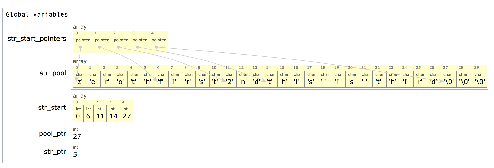

----
title: Reading the POOLtype program by Donald Knuth
date: 2019-01-20
----

<style>
object {
	border: 2px solid grey;
}
img {
    max-width: 100%;
}
body {
	/* Trying to match the SVGs but I don't know how this number is determined */
	max-width: 651px;
}
</style>

We begin our study of DEK's programs (leading up to TeX) with `POOLtype`.

It is a very simple (almost trivial) program, but reading it is useful to get a glimpse of WEB, of the programming style, etc.

## Background: string pools

The year is 1980 or so. You're having to write programs in PASCAL, trying to stick to the standard version, but coming up against its limitations. What do you do?

If you are Brian W. Kernighan, you'll write an influential article called “Why Pascal is Not My Favorite Programming Language” ([HTML](https://www.lysator.liu.se/c/bwk-on-pascal.html), [PDF](http://doc.cat-v.org/bell_labs/why_pascal/why_pascal_is_not_my_favorite_language.pdf)). The top reason: without using one of the various diverging and nonstandard extensions to Pascal, if you wrote a function that takes a string as input parameter, it had to be a string of a fixed length — a string was an array of characters, and arrays of different lengths were different types. (If you wanted to handle strings of different lengths, you could create a separate function for each length.)

If you are Donald E. Knuth, and given to things like [writing your own assembler](http://ed-thelen.org/comp-hist/B5000-AlgolRWaychoff.html#7) as a matter of course, then you deal with these problems by ignoring the language's insufficient solutions and building your own. 

String pools were his solution to the string problem: in his program he simply declared a giant array of characters, and every string that was wished to be stored in the program would have its characters stored sequentially in that array, with a separate array for keeping track of where each string starts.

For example, suppose you have four strings “zeroth”, “first”, “2nd”, and “this is third”. They might go into the `str_pool` and `str_start` arrays as follows (I added the `str_start_pointers` array just for clarity in case it helps; it's a version of `str_start` that uses pointers instead of indices… the TeX program does not use Pascal's pointer types, and uses only integer indices but calls them pointers):

[](str_pool.png)

Apart from strings that the program needs to construct at runtime, there are also strings that are part of the program itself: error messages and the like. These are populated into the string pool at the start of the program, via the mechanism of the WEB preprocessor (the `TANGLE` program) dumping them to a `.pool` file, and the program containing code to read from the `.pool` file at startup, to populate its string pool.

## What the POOLtype program does

If you skipped the previous section, some background: WEB programs are processed by the program `TANGLE`, which (apart from the main `.pas` file) generates a `.pool` file. For example, `tex.pool` may look like this:

    11buffer size
    09pool size
    17number of strings
    03???
    13m2d5c2l5x2v5i
    28End of file on the terminal!
    02! 
    42(That makes 100 errors; please try again.)
    02? 
    22You want to edit file 

... continued ...

    05mskip
    02mu
    00
    08leaders 
    04kern

... continued ...

    08whatsit?
    04ext2
    04ext3
    08endwrite
    24Unbalanced write command
    59On this page there's a \write with fewer real {'s than }'s.
    04ext4
    16output file name
    *117275187

So as you can see, it consists of a bunch of lines, on each of which the first two characters are ASCII digits '0' to '9' representing the length of the string, and the rest of the characters are the actual string. (If you're wondering about lines 7 and 9 above, they are “02! ” and “02? ” – they end with a space.) The last line contains a kind of hash (not a cryptographic one, just a simple check).

All that the `POOLtype` program does is read this file, and print it again, in the following form:

```
0: "^^@"
1: "^^A"
2: "^^B"
3: "^^C"
...
65: "A"
66: "B"
67: "C"
68: "D"
...
252: "^^fc"
253: "^^fd"
254: "^^fe"
255: "^^ff"
256: "buffer size"
257: "pool size"
258: "number of strings"
259: "???"
260: "m2d5c2l5x2v5i"
261: "End of file on the terminal!"
262: "! "
263: "(That makes 100 errors; please try again.)"
264: "? "
265: "You want to edit file "
...
336: "mskip"
337: "mu"
338: ""
339: "leaders "
340: "kern"
...
1292: "whatsit?"
1293: "ext2"
1294: "ext3"
1295: "endwrite"
1296: "Unbalanced write command"
1297: "On this page there's a \write with fewer real {'s than }'s."
1298: "ext4"
1299: "output file name"
(23437 characters in all.)
```

So as you can see, it simply prints out the strings in the `tex.pool` file in a *slightly* more human-readable way, with a few changes:

* Strings 0 to 255 are the characters 0 to 255; the strings in the `tex.pool` file start at position 256.
* Unprintable characters are shown using `^^x` escape codes.
* The double-quote character `"` is printed as `""`.
* The total count of characters printed is shown.

Nevertheless, this trivial program provides some basic sanity testing to make sure that the TeX program would start up with the right `tex.pool` file and not something corrupted.

## A Python implementation

To make it clearer what POOLtype does, here is a Python implementation that has the same output as `POOLtype`, on a valid `tex.pool` file (it only tries to match the output, i.e. doesn't do error checking):

```python
from __future__ import print_function
import sys

def escape(c):
    # Printable characters don't need escaping.
    if ord(' ') <= ord(c) <= ord('~'): return c
    # Characters 0 to 31 are escaped as ^^ + one 64 ahead
    if ord(c) < 64:
        return '^^' + chr(ord(c) + 64)
    # 127 is escaped as ^^ + (127 - 64)
    if ord(c) == 127: return '^^?'
    # 128 to 255 are escaped as ^^ + two lowercase hex chars
    h = hex(ord(c))[2:]
    return '^^' + h

chars = 0
n = 0
while n < 256:
    out = escape(chr(n))
    chars += len(out)
    print('%d: "%s"' % (n, out.replace('"', '""')))
    n += 1
for line in open(sys.argv[1]).readlines():
    if line.startswith('*'): break
    length = int(line[:2])
    string = line[2:-1]
    out = ''.join(escape(c) for c in string)
    chars += len(out)
    print('%d: "%s"' % (n, out.replace('"', '""')))
    n += 1
print('(%d characters in all.)' % chars)
```

There's a bit more that the real  `POOLtype` program does, which we'll see as we read it.

## POOLtype

Finally, let's look at `POOLtype` itself.

This program, like others written in `WEB` at the time TeX was written, was intended to be read on paper. (That's just how Knuth programs.) It's available in PDF form in any TeX distribution; e.g. you can see a [PDF of the POOLtype program here](http://texdoc.net/texmf-dist/doc/generic/knuth/texware/pooltype.pdf).

To embed on this webpage, I'm instead going to treat each section separately.

There is a contents page:

<object type="image/svg+xml" data="pooltype-24.svg"></object>

The program is divided into 21 sections (followed by an index as section 22). The idea of literate programming with WEB is to write a program as a “web” of interconnected sections, such that the program can be understood by understanding the relationship between the sections and understanding each section in itself.

As we can see, these 21+1 sections are grouped into 4+1 parts:

* Part 1, called “Introduction”, contains sections 1 to 3
* Part 2, “The character set”, contains sections 4 to 11, 
* Part 3, “String handling” contains sections 12 to 20, 
* Part 4, “System-dependent changes”, is section 21 (we'll see later it's “empty”)
* Part 5 is the Index (of variables and of section names).

The page numbers start at 102 because this (`POOLtype`) was part of a bigger [“TeXware” report](http://i.stanford.edu/pub/cstr/reports/cs/tr/86/1097/CS-TR-86-1097.pdf). (Actually though true, that's not the reason; the starting page number of this contents page was somewhat arbitrarily chosen as 101; similarly the other programs in TeXware start at pages [201 (TFtoPL)](http://texdoc.net/texmf-dist/doc/generic/knuth/texware/tftopl.pdf), [301 (PLtoTF)](http://texdoc.net/texmf-dist/doc/generic/knuth/texware/pltotf.pdf) and [401 (DVItype)](http://texdoc.net/texmf-dist/doc/generic/knuth/texware/dvitype.pdf) respectively.)

Anyway, let's read each section in turn.

### Part 1: Introduction

<object type="image/svg+xml" data="pooltype-01.svg"></object>

Every section of a WEB program consists of an optional (TeX) text part, followed by an optional (WEB macro) definitions part, followed by an optional (Pascal) code part. This one has only the text part.

How `POOLtype` could be useful when a program is being debugged: suppose you see that your program is trying to print string 456. Then you can use the output of `POOLtype` to see what that string is. (Of course, this helps only for the strings that are in the program itself, i.e. the ones the program loads from the pool file and starts up with -- it's no help for strings that were constructed later, at runtime.)

“It's a pretty trivial routine” — it seems the words “program” and “routine” were used somewhat interchangeably; in some places DEK uses “the following program” to mean “the following bit of code”.

The “people may want to try transporting this program” refers to people who were (what we'd now call) sysadmins at other places / computer systems, installing TeX for their users — they'd have to adapt TeX with (hopefully minimal) “system-dependent changes” specific to their system, and the idea is that this program POOLtype is good practice for doing so.

Finally, note “routines copied from $\mathrm{\TeX82}$”. DEK is pretty free about copying code between different programs, where most of us programmers today would go to great lengths to avoid doing so.

Anyway, enough exegesis on three sentences; let's move on to Section 2.

----

<object type="image/svg+xml" data="pooltype-02.svg"></object>

Here we see a text part followed by a code part. 

I think “standard Pascal” here means the language as described in the “PASCAL User Manual and Report” (1975), by Kathleen Jensen and Niklaus Wirth, without any of the various extensions that had been added by various compilers in practice. (Being able to write anything substantial in only standard Pascal was a big deal; see Appendix.)

Note a few things here:

* If you haven't encountered WEB programs before, something like “⟨Types in the outer block 5⟩” means “the text of section 5, whose title is ‘Types in the outer block’, must be placed into the program here”.
* So in some sense this serves as an “outline”, leaving placeholders to be filled in by later sections. However, note that this is only an outline for the top part of the program, not the entire program: the top-level text of the program continues with the next section that is not referenced by (part of) another (in this program that's section 15 as we'll see later).
* The order of these top-level/global declarations (labels must be declared before types before variables before procedures) is enforced by Pascal, which was one of Kernighan's complaints.
* Note there's a label, for use with `goto`. Knuth uses `goto` to implement his own control structures, though they tend to be used in a systematic way rather than ad-hoc control flow for each function.
* There are global variables: to some extent this is influenced by the limitations of Pascal, and to some extent this is just Knuth's preference/style.
* Pascal programs took files as parameters to their “program” declaration, and the Pascal runtime would be in charge of making sure the program got those files. This is unlike most languages today where either we read/write from/to stdin/stdout (I guess redirection to file wasn't common then?), or parse command-line arguments or user input to get filename, and then open the file.
* Note that not everything in the code is described in the text part (and there are `{...}` comments in the code too); you have to read the code. This is a misconception some people have about literate programming, that it's about being verbose and redundantly describing everything that is in code in words too.

Moving on to section 3.

----

<object type="image/svg+xml" data="pooltype-03.svg"></object>

This section has text, followed by WEB macro definitions (no Pascal code). WEB has macros, with which DEK basically extends the programming language. Part of the popularity of C over Pascal must come from things like C having increment/decrement operators, and being able to write a semicolon to denote an empty statement. :-)

And with that, we're already done with Part 1, introduction. The code we saw so far was the outline in section 2 above.

### Part 2: The character set

<object type="image/svg+xml" data="pooltype-04.svg"></object>

Code being copied verbatim between programs! The shock, the horror! It works out fine though.

Note it says “portable between a wide variety of **computers**”, where today we'd probably say something more specific, like “encodings”, or at most “operating systems”. The reason is that computers back then tended to come with their own operating systems, their own ecosystems of software, all expecting similar conventions for encoding, and so on.

And of course there was no Unicode then, and even ASCII was alien to some systems (that used EBCDIC for instance). Nevertheless, the approach of converting from the system's characters to a uniform internal code immediately after input, and converting back just before output, is very much like the modern [Unicode sandwich](https://nedbatchelder.com/text/unipain.html) approach.

The internal code here *includes* standard ASCII, i.e. it has a few more characters (or in other words: what's unprintable in ASCII is sometimes assigned here).

We'll ignore the last two paragraphs for now as they're more relevant to TeX than to POOLtype. Moving on to section 5.

----

<object type="image/svg+xml" data="pooltype-05.svg"></object>

This section fills out the “Types in the outer block” that was left unfilled in section 2 earlier. (Note the “This code is used in section 2” at the bottom, which sets the context for this section: I've found it useful when reading WEB programs to look for that first.) It turns out there's only one global type declaration for this program. That defines the type `ASCII_code` to mean the range of integers `0..255`. Note that a type in Pascal was more explicitly a set (or range) of values that could be stored in a variable, which (at least for integer types) is an improvement over the type system in C / C++ / Java / Python etc. In fact, it [appears](https://softwareengineering.stackexchange.com/questions/198919/a-programming-language-that-allows-you-to-define-new-limits-for-simple-types) that in this respect, Pascal (and its descendant Ada) have the advantage over most programming languages.

Anyway, though it's called `ASCII_code`, it's really more like “TeX-internal character code” (the way Unicode is independent of encodings).

----

<object type="image/svg+xml" data="pooltype-06.svg"></object>

We get a glimpse of the lengths to which TeX went, to be portable across different Pascal implementations (and possibly some other languages too). The problem is this: suppose you read a character from a file. What is the name for the type of this character, in your programming language? It changed across Pascal implementations: in the one DEK was using, this type was called `char` and consisted of `chr(0)` to `chr(255)` (maybe not in 1982 though); in another, it may have had another name like `extended_char` or whatever, and consist of only `chr(32)` to `chr(126)`. To make it easier for someone porting TeX, everywhere the program uses the type `text_char`, which is *defined* as `char` in the baseline TeX implementation but on another system may simply be redefined to whatever the name of the type is.

Note the usage of octal notation: `'40` means 32, and `'176` means 126. Better get used to reading octal if reading the TeX program; it comes up a lot.

The code part is not really related to the rest I guess... note that the “Local variables for initialization” are part of the procedure `initialize`, not of the “global” scope.

----

<object type="image/svg+xml" data="pooltype-07.svg"></object>

The code in this section replaces the “Globals in the outer block” that was left as a placeholder in section 2, but it's only the first such section: as it says at the bottom, there are more globals, defined in sections 12, 13, and 18. With this mechanism, DEK solves one of the problems mentioned by Kernighan, that many variables need to be global and all of them have to be declared in one block, far away from where they are used.

Here the code defines two very important arrays:

- `xord`, whose keys (indices) are of type `text_char` and whose values are of type `ASCII_code`. When the program reads in a (system and encoding-dependent) “character” `c` (of type `text_char` = `char`, see previous section) from a text file, it is immediately translated to `xord[c]`, which is of type `ASCII_code`, the TeX-internal character code which (like Unicode) is independent of the encoding used.

- `xchr`, whose keys (indices) are of type `ASCII_code` and whose values are of type `text_char`. When the program wants to write out a character `c` (of type `ASCII_code`, i.e. the TEX-internal character code that is independent of encoding), it is first translated to `xchr[c]`, which is of type `text_char`, the system and encoding-dependent one that is actually expected by the files on that system.

This is like the “Unicode sandwich” approach in Python mentioned earlier, where we call `decode(<encoding>)` immediately after reading from a file (converting from the encoding-specific byte sequence to “universal” Unicode codepoints) and call `encode(<encoding>)` just before writing out (encoding-specific) byte sequences to a file.

Note the Pascal feature, where array indices and values can be subrange types: for example on some system the type `text_char` might have been defined as range `32..126`, and of course `ASCII_code` was defined in section 5 above as the range `0..255`, so this is like saying:

    xord: array[32..126] of 0..255;
    xchr: array[0..255] of 32..126;

and such code is valid in Pascal.

----

<object type="image/svg+xml" data="pooltype-08.svg"></object>

You can go back and refer to section 2 to see how this section is used, to remind yourself that this section starts the body of the `initialize` procedure. (There are more things to be initialized; see the "see also sections 10, 11, and 14" below.)

There's a trick here, to why this doesn't need any system-dependent changes. For example, consider the assignment statement `xchr['101] = 'A'`, or (using decimal instead of octal) `xchr[65] = 'A'`. Now, suppose this program was being compiled and run on a system that used EBCDIC encoding, where 'A' is encoded as byte 193. Then, this assignment statement would get interpreted and compiled as `xchr[65] = 193`. So that when TeX wants to translate from its internal code 65 (which always means 'A') to the system's encoding (to print out 'A' on the terminal or write it to a file), it would look up `xchr[65]`, find 193, and write out byte 193 to the file or terminal, and everything works as desired!

Changes are needed only if, for example, the character set (encoding) used does not contain, say `|`. Then the assignment `xchr[124] = '|'` should be changed to however it is proposed to print the character `|` (if it turns up) on that system.

(Actually, though DEK may not acknowledge it, the way this section is typeset already shows vestiges of the SAIL/SU-AI character set being different from present-day ASCII: whereas in ASCII the `'` character is a straight single quote, in certain older character sets the same position was used for a slanted `’` character. That's why we still see e.g. old GNU manuals and TeX code contain quotation like

    ``this''

which today just looks wrong. See Markus Kuhn's page [ASCII and Unicode quotation marks](https://www.cl.cam.ac.uk/~mgk25/ucs/quotes.html) and the package [`upquote`](https://ctan.org/pkg/upquote) ([doc](http://mirrors.ctan.org/macros/latex/contrib/upquote/upquote.pdf)) for more.)

----

<object type="image/svg+xml" data="pooltype-09.svg"></object>

Incidentally, `null_code` and `carriage_return`, though defined here as WEB macros, are not actually used in the program.

----

<object type="image/svg+xml" data="pooltype-10.svg"></object>

If some other character (0 to 31, or 127 to 255) gets into TeX, and is about to be printed, what should it be printed as? DEK thinks it's safest to use a space by default (as these characters won't get into TeX on “standard ASCII” systems), though any system may make its own choice. In fact, on his own local environment at Stanford at the time, there were characters like `≠` and the system-dependent changefile for that system made these changes.

Note we talking of TeX above, though this program we're reading is actually POOLtype. Oops. Well, POOLtype must make the same decisions as TeX so that's probably ok.

----

<object type="image/svg+xml" data="pooltype-11.svg"></object>

Having decided how TeX-internal characters will printed (i.e. having populated the `xchr` array), we now need to decide the inverse: what should characters from the text file be read as? We could write out a long list of assignments as in section 8 above, but we can also use the `xchr` array. The code starts with a conservative policy:

- First declare every character invalid, as default (i.e. when TeX reads that character from the file, it converts it to its internal code 127). Note that if for some external code `c`, there's no internal character `i` with `xchr[i] = c`, then `xord[c]` will remain undefined.

- For *TeX-internal* characters `i` from 128 to 255, set `xord[xchr[i]]` to `i`. If they're all defined to have `xchr[i] = ' '`, then well we'll just set `xord[' '] = i` again and again.

- For TeX-internal characters `i` from 0 to 126, set `xord[xchr[i]]` to `i`.

The order of these two loops ensures that if there are multiple internal character codes that get printed as the same external character (how likely is that?), then the order of preference is

    128, 129, ..., 255, 0, 1, 2, ..., 32, 33, ..., 126

so that printable ASCII codes (32 to 126) are most preferred.

### Part 3: String handling

Finally, after half the program is done, we come to the main part of this program.

<object type="image/svg+xml" data="pooltype-12.svg"></object>

Global variables are always a pain to understand. By convention, single-letter variables are for unimportant things like loop indices or temporary variables.

<object type="image/svg+xml" data="pooltype-13.svg"></object>

One thing that helps understand these programs is think about what needs to be done, and how you would do it. In this case, we want to print `"<count> characters in all"` at the end, so we need to keep track of the count.

<object type="image/svg+xml" data="pooltype-14.svg"></object>

Note that with WEB, we're able to keep the declaration and initialization close, even though they're textually far apart in the actual program that Pascal sees.

<object type="image/svg+xml" data="pooltype-15.svg"></object>

Recall that section 2 only had an outline of the top of the program. Everything in it has now been filled (except some globals yet to be declared), and this is the rest. The “main” of the program is above, between `begin` and `end`, with certain placeholders that will be filled by sections 16 and 19. Note that `initialize` is a procedure call. The macro `abort` is defined here (so that we can understand what the `goto 9999` in it is referring to), but we'll just keep it in mind for now; it's used later.

<object type="image/svg+xml" data="pooltype-16.svg"></object>

The arithmetic in `lc_hex` (set `l` to the lowercase hex representation of a number from 0 to 15) is done by TANGLE; Pascal just sees, in place of `lc_hex(n)`, the following:

    l := n;
    if l < 10 then l := l + 48 else l := l + 87

The code is reasonably straightforward, especially if you keep in mind what the goal is, but a few peculiarities (of Pascal and of WEB) are worth calling out:

- `write(k : 3, ': ')` means to write `k` to width at least `3`, and then print the string `': '` -- it looks like the `pooltype` that comes with TeX Live does not obey the `: 3` specifier. (MikTeX seems to.)

- Unprintable characters in range 0 to 63 are escaped by adding 64 (using counterparts in range 64 to 127); those in range 64 to 127 are escaped by subtracting 64 (using counterparts in range 0 to 63), and those 128 or more are escaped with two hex characters.

- The condition for “k is unprintable” is moved to a separate section, so that it can be given a more elaborate comment, and also so that system-dependent changes to it don't make the section too long. (Also, so that only it can be marked system-dependent, rather than the whole section 16.)

The formatting is also a bit weird: blocks have `begin` and `end` at the same indent but within them the first statement after `begin` tends to start to the right of the `begin`, and in generation the statements are just lumped together on the line for no apparent reason. (This was considered desirable, it [appears](https://i.stack.imgur.com/jA9q7.png).)


<object type="image/svg+xml" data="pooltype-17.svg"></object>

One line of code, but a system-dependent one (and on certain systems could be less trivial). The text part documents the previous section, sort of. The default is that characters 32 to 126 are printable and the rest not, but these are the character codes that it says must be printable:

- octal `'41` to `'46` = decimal 33 to 38 = `!"#$%&` (used in error messages and the like)

- octal `'60` to `'71` = decimal 48 to 57 = `0123456789`

- octal `'141` to `'146` = decimal 97 to 102 = `abcdef` (used in hexadecimal)

- octal `'160` to `'171` = decimal 112 to 121 = `pqrstuvwxy` (used for things like `pt` I guess?)

For fun, let's verify the number 80:

```python
def forced(k):
   return any(k in l for l in [range(33, 39), range(48, 58), range(97, 103), range(112, 122)])
tot = 0 
for i in range(64): 
   contrib = 2 if forced(i) and forced(i + 64) else 1 
   print('%d \t %s \t %d \t %s \t %s' % (i, forced(i), i + 64, forced(i + 64), contrib)) 
   tot += contrib 
print(tot)
```

prints 80.

Incidentally, though these sections are said to be copied verbatim from TeX, in section 49 there, there's an additional character octal '136 (= decimal 94, character `^`) that is required to be printable, and the count is given as 81. But changing our above code and running the program again, we still get 80 -- that's because it was already required that at least one of {30, 94} be printable, and forcing 94 to be printable doesn't change the count. It appears this mistake has already been reported twice though (see [this](https://tug.org/pipermail/tex-k/2018-April/002876.html) and [reply](https://tug.org/pipermail/tex-k/2018-April/002878.html)).

<object type="image/svg+xml" data="pooltype-18.svg"></object>

These are the last globals to be declared. :-) BTW, another reason for so many global variables is that any variable needed by `main`, i.e. the `begin .. end` block that constitutes the main block of the program, needs to be global, I think. (Kernighan: “The result is that any variable that is to be initialized has global scope.”) So it would be useful to distinguish between variables that are global because they are needed by multiple procedures, and those that are global just because they are referenced by the main body of the function (what would in C be declared local to `main`).

And if it seems a bit strange to be explaining what the program does towards the end of the program: I'm afraid it's not unusual for DEK, though in this case the explanation is simply changing “the INITEX program” in the TeX source to “the present program” here.

<object type="image/svg+xml" data="pooltype-19.svg"></object>

The only placeholder we haven't filled so far. `reset` is the Pascal way of rewinding to the beginning of the file so it can be read from; basically `fopen` in this case.

Straightforward code, though it's nice how the looping logic has been separated from a single iteration of the loop.

<object type="image/svg+xml" data="pooltype-20.svg"></object>

Note that though this is the last section with code, this is really the heart of the program.

Again does the obvious thing, except for this one which I'm not sure whether it's trickery or normal for the time: what we'd write

    l := (cm - '0') * 10 + (cn - '0')

is here written as (basically)

    l := cm * 10 + cn - '0' * 11

with Pascal seeing actually

	l := cm * 10 + cn - 48 * 11

as TANGLE translates `"0"` into 48.

Anyway, this is the end of the program, so I guess it doesn't verify the hash code either. Oh well.

<object type="image/svg+xml" data="pooltype-21.svg"></object>

If someone wants to add new sections to the program, best to add them at the end.

<object type="image/svg+xml" data="pooltype-22.svg"></object>

Apart from variables and macros, also topics and mentions of books/people are indexed, and “character set dependencies” and “system dependencies”. The underline means that the variable/macro was defined in that section.

<object type="image/svg+xml" data="pooltype-23.svg"></object>

Index of module names.

## Appendix

### The output of tangle

This is the program as seen by Pascal (the `pooltype.p` file generated by TANGLE):

```pascal
{2:}program POOLtype(poolfile,output);label 9999;
type{5:}ASCIIcode=0..255;{:5}var{7:}xord:array[char]of ASCIIcode;
xchr:array[ASCIIcode]of char;{:7}{12:}k,l:0..255;m,n:char;s:integer;
{:12}{13:}count:integer;{:13}{18:}poolfile:packed file of char;
xsum:boolean;{:18}procedure initialize;var{6:}i:integer;
{:6}begin{8:}xchr[32]:=' ';xchr[33]:='!';xchr[34]:='"';xchr[35]:='#';
xchr[36]:='$';xchr[37]:='%';xchr[38]:='&';xchr[39]:='''';xchr[40]:='(';
xchr[41]:=')';xchr[42]:='*';xchr[43]:='+';xchr[44]:=',';xchr[45]:='-';
xchr[46]:='.';xchr[47]:='/';xchr[48]:='0';xchr[49]:='1';xchr[50]:='2';
xchr[51]:='3';xchr[52]:='4';xchr[53]:='5';xchr[54]:='6';xchr[55]:='7';
xchr[56]:='8';xchr[57]:='9';xchr[58]:=':';xchr[59]:=';';xchr[60]:='<';
xchr[61]:='=';xchr[62]:='>';xchr[63]:='?';xchr[64]:='@';xchr[65]:='A';
xchr[66]:='B';xchr[67]:='C';xchr[68]:='D';xchr[69]:='E';xchr[70]:='F';
xchr[71]:='G';xchr[72]:='H';xchr[73]:='I';xchr[74]:='J';xchr[75]:='K';
xchr[76]:='L';xchr[77]:='M';xchr[78]:='N';xchr[79]:='O';xchr[80]:='P';
xchr[81]:='Q';xchr[82]:='R';xchr[83]:='S';xchr[84]:='T';xchr[85]:='U';
xchr[86]:='V';xchr[87]:='W';xchr[88]:='X';xchr[89]:='Y';xchr[90]:='Z';
xchr[91]:='[';xchr[92]:='\';xchr[93]:=']';xchr[94]:='^';xchr[95]:='_';
xchr[96]:='`';xchr[97]:='a';xchr[98]:='b';xchr[99]:='c';xchr[100]:='d';
xchr[101]:='e';xchr[102]:='f';xchr[103]:='g';xchr[104]:='h';
xchr[105]:='i';xchr[106]:='j';xchr[107]:='k';xchr[108]:='l';
xchr[109]:='m';xchr[110]:='n';xchr[111]:='o';xchr[112]:='p';
xchr[113]:='q';xchr[114]:='r';xchr[115]:='s';xchr[116]:='t';
xchr[117]:='u';xchr[118]:='v';xchr[119]:='w';xchr[120]:='x';
xchr[121]:='y';xchr[122]:='z';xchr[123]:='{';xchr[124]:='|';
xchr[125]:='}';xchr[126]:='~';{:8}{10:}for i:=0 to 31 do xchr[i]:=' ';
for i:=127 to 255 do xchr[i]:=' ';
{:10}{11:}for i:=0 to 255 do xord[chr(i)]:=127;
for i:=128 to 255 do xord[xchr[i]]:=i;
for i:=0 to 126 do xord[xchr[i]]:=i;{:11}{14:}count:=0;{:14}end;
{:2}{15:}begin initialize;
{16:}for k:=0 to 255 do begin write(k:3,': "');l:=k;
if({17:}(k<32)or(k>126){:17})then begin write(xchr[94],xchr[94]);
if k<64 then l:=k+64 else if k<128 then l:=k-64 else begin l:=k div 16;
if l<10 then l:=l+48 else l:=l+87;write(xchr[l]);l:=k mod 16;
if l<10 then l:=l+48 else l:=l+87;count:=count+1;end;count:=count+2;end;
if l=34 then write(xchr[l],xchr[l])else write(xchr[l]);count:=count+1;
writeln('"');end{:16};s:=256;{19:}reset(poolfile);xsum:=false;
if eof(poolfile)then begin writeln('! I can''t read the POOL file.');
goto 9999;end;repeat{20:}if eof(poolfile)then begin writeln(
'! POOL file contained no check sum');goto 9999;end;read(poolfile,m,n);
if m<>'*'then begin if(xord[m]<48)or(xord[m]>57)or(xord[n]<48)or(xord[n]
>57)then begin writeln('! POOL line doesn''t begin with two digits');
goto 9999;end;l:=xord[m]*10+xord[n]-48*11;write(s:3,': "');
count:=count+l;
for k:=1 to l do begin if eoln(poolfile)then begin writeln('"');
begin writeln('! That POOL line was too short');goto 9999;end;end;
read(poolfile,m);write(xchr[xord[m]]);
if xord[m]=34 then write(xchr[34]);end;writeln('"');s:=s+1;
end else xsum:=true;readln(poolfile){:20};until xsum;
if not eof(poolfile)then begin writeln(
'! There''s junk after the check sum');goto 9999;end{:19};
writeln('(',count:1,' characters in all.)');9999:end.{:15}
```

and this is the output with some formatting:

```pascal
{2:}
program POOLtype(poolfile,output);
label 9999;
type
   {5:}
   ASCIIcode=0..255;
   {:5}
var
   {7:}
   xord:array[char]of ASCIIcode;
   xchr:array[ASCIIcode]of char;
   {:7}
   {12:}
   k,l:0..255;
   m,n:char;
   s:integer;
   {:12}
   {13:}
   count:integer;
   {:13}
   {18:}
   poolfile:packed file of char;
   xsum:boolean;
   {:18}
procedure initialize;
var
   {6:}
   i:integer;
   {:6}
begin
   {8:}
   xchr[32]:=' ';xchr[33]:='!';xchr[34]:='"';xchr[35]:='#';
   xchr[36]:='$';xchr[37]:='%';xchr[38]:='&';xchr[39]:='''';xchr[40]:='(';
   xchr[41]:=')';xchr[42]:='*';xchr[43]:='+';xchr[44]:=',';xchr[45]:='-';
   xchr[46]:='.';xchr[47]:='/';xchr[48]:='0';xchr[49]:='1';xchr[50]:='2';
   xchr[51]:='3';xchr[52]:='4';xchr[53]:='5';xchr[54]:='6';xchr[55]:='7';
   xchr[56]:='8';xchr[57]:='9';xchr[58]:=':';xchr[59]:=';';xchr[60]:='<';
   xchr[61]:='=';xchr[62]:='>';xchr[63]:='?';xchr[64]:='@';xchr[65]:='A';
   xchr[66]:='B';xchr[67]:='C';xchr[68]:='D';xchr[69]:='E';xchr[70]:='F';
   xchr[71]:='G';xchr[72]:='H';xchr[73]:='I';xchr[74]:='J';xchr[75]:='K';
   xchr[76]:='L';xchr[77]:='M';xchr[78]:='N';xchr[79]:='O';xchr[80]:='P';
   xchr[81]:='Q';xchr[82]:='R';xchr[83]:='S';xchr[84]:='T';xchr[85]:='U';
   xchr[86]:='V';xchr[87]:='W';xchr[88]:='X';xchr[89]:='Y';xchr[90]:='Z';
   xchr[91]:='[';xchr[92]:='\';xchr[93]:=']';xchr[94]:='^';xchr[95]:='_';
   xchr[96]:='`';xchr[97]:='a';xchr[98]:='b';xchr[99]:='c';xchr[100]:='d';
   xchr[101]:='e';xchr[102]:='f';xchr[103]:='g';xchr[104]:='h';
   xchr[105]:='i';xchr[106]:='j';xchr[107]:='k';xchr[108]:='l';
   xchr[109]:='m';xchr[110]:='n';xchr[111]:='o';xchr[112]:='p';
   xchr[113]:='q';xchr[114]:='r';xchr[115]:='s';xchr[116]:='t';
   xchr[117]:='u';xchr[118]:='v';xchr[119]:='w';xchr[120]:='x';
   xchr[121]:='y';xchr[122]:='z';xchr[123]:='{';xchr[124]:='|';
   xchr[125]:='}';xchr[126]:='~';
   {:8}
   {10:}
   for i:=0 to 31 do xchr[i]:=' ';
   for i:=127 to 255 do xchr[i]:=' ';
   {:10}
   {11:}
   for i:=0 to 255 do xord[chr(i)]:=127;
   for i:=128 to 255 do xord[xchr[i]]:=i;
   for i:=0 to 126 do xord[xchr[i]]:=i;
   {:11}
   {14:}
   count:=0;
   {:14}
end;
{:2}
{15:}
begin
   initialize;
   {16:}
   for k:=0 to 255 do
   begin
      write(k:3,': "');
      l:=k;
      if({17:}(k<32)or(k>126){:17}) then
      begin
         write(xchr[94],xchr[94]);
         if k<64 then
            l:=k+64
         else if k<128 then
            l:=k-64
         else
         begin
            l:=k div 16;
            if l<10 then l:=l+48 else l:=l+87;
            write(xchr[l]);
            l:=k mod 16;
            if l<10 then l:=l+48 else l:=l+87;
            count:=count+1;
         end;
         count:=count+2;
      end;
      if l=34 then
         write(xchr[l],xchr[l])
      else
         write(xchr[l]);
      count:=count+1;
      writeln('"');
   end
   {:16};
   s:=256;
   {19:}
   reset(poolfile);
   xsum:=false;
   if eof(poolfile) then
   begin
      writeln('! I can''t read the POOL file.');
      goto 9999;
   end;
   repeat
      {20:}
      if eof(poolfile) then
      begin
         writeln('! POOL file contained no check sum');
         goto 9999;
      end;
      read(poolfile,m,n);
      if m<>'*'then
      begin
         if(xord[m]<48)or(xord[m]>57)or(xord[n]<48)or(xord[n]>57)then
         begin
            writeln('! POOL line doesn''t begin with two digits');
            goto 9999;
         end;
         l:=xord[m]*10+xord[n]-48*11;
         write(s:3,': "');
         count:=count+l;
         for k:=1 to l do
         begin
            if eoln(poolfile) then
            begin
               writeln('"');
               begin
                  writeln('! That POOL line was too short');
                  goto 9999;
               end;
            end;
            read(poolfile,m);
            write(xchr[xord[m]]);
            if xord[m]=34 then
               write(xchr[34]);
         end;
         writeln('"');
         s:=s+1;
      end
      else
         xsum:=true;
      readln(poolfile)
      {:20};
   until xsum;
   if not eof(poolfile) then
   begin
      writeln('! There''s junk after the check sum');
      goto 9999;
   end
   {:19};
   writeln('(',count:1,' characters in all.)');
9999:
end.
{:15}
```

-- question: has WEB / literate programming helped?

### Other problems with Pascal

There were other problems that Kernighan identified with standard Pascal as of 1981. Interestingly, Knuth must have run into many of these problems as well, but he came up with his “literate programming” (tangle + weave) pre-processing system as a way of solving them.

- If you wanted to write a function that persists some “state” across function calls (e.g. a random number generator), in C you'd use a static variable (and in more modern languages probably a class), while in Pascal you'd have to use a (typically) global variable, declared far away from the function.

  > In Pascal, the code looks like this:

      program formatter (...);
      
      var
             dir : 0..1;     { direction to add extra spaces }
             .
             .
             .
      procedure justify (...);
      begin
             dir := 1 - dir; { opposite direction from last time }
             ...
      end;
      
             ...
      
      begin { main routine of formatter }
             dir := 0;
             ...
      end;

  > The declaration, initialization and use of the variable `dir` are scattered all over the program, literally hundreds of lines apart.

  ​  With literate programming, this is solved by writing them together in the program, in (say) consecutive small sections. The TANGLE processor will take care of putting them in the proper places in the program.

- Procedures must be declared (body and all) before they are used; all declarations of the same kind (e.g. all type declarations) should be grouped together — and need to come up with names for ad-hoc types

	With literate programming, this is solved: one can write one's program in practically any order.

- If a procedure modifies its argument (“var” parameters), this is not clear at the caller. (Incidentally this is why the [Google C++ style guide bans non-const references as function parameters](https://google.github.io/styleguide/cppguide.html#Reference_Arguments).)

	Solved by DEK by just never using `var` (mutating) parameters except for files.

- set types can be non-portable
  
    DEK does not use set types

- “it is not possible to write programs like storage allocators or I/O systems”

	TeX does all its own memory allocation

- There is no “break” for exiting loops, nor “return” for exiting a function, and no default `case` label

	Done with `define` and `goto` -- DEK basically invents his own few control structures ("break", "return", "reswitch", "restart") and implements them with "goto".

- I/O and file handling are complicated

	Just do it :-)

- The language has pointer types and “new” but they have problems (cannot allocate arrays of non-fixed size… “I found relatively little use for pointers.”)

	DEK does not use pointers or `new`.

- there is no macro processor

	WEB (TANGLE) is the macro processor.

- cannot put expressions in declarations (e.g. an array of size “n + 1” where “n” is known at compile time)

	WEB (TANGLE) allows this.

Overall, Kernighan concluded: 

> It is suitable only for small, self-contained programs that have only trivial interactions with their environment and that make no use of any software written by anyone else.

and Knuth (in his "WEB" language) wrote a big program with nontrivial interactions with the environment, but of course not using any software written by anyone else.

It so happens (see [1](http://pascal-central.com/ppl/chapter4.html#Myth6), [2](http://wiki.lazarus.freepascal.org/Why_Pascal_is_Not_My_Favorite_Programming_Language)) that some of the diverging and nonstandard extensions to Pascal mentioned above have, over the passage of years, converged more-or-less, so what you may encounter under the name of “Pascal” today (2019) has fewer (though not none) of these problems. But in any case, that's irrelevant to our story as of 1980.

### The str_pool figure above

It was generated with the following program typed into Prof. Philip Guo's fantastic [pythontutor.com website](http://pythontutor.com/c.html#mode=edit):

```c
char* str_start_pointers[5];
char str_pool[30];
int str_start[5];
int pool_ptr;
int str_ptr;

void add_string(char* s) {
  for (int i = 0; s[i] != '\0'; ++i) {
    str_pool[pool_ptr++] = s[i];
  }
  str_start[str_ptr] = pool_ptr;
  str_start_pointers[str_ptr] = &str_pool[pool_ptr];
  ++str_ptr;
}

int main() {
  str_start[str_ptr] = pool_ptr;
  str_start_pointers[str_ptr] = &str_pool[pool_ptr];
  ++str_ptr;
  add_string("zeroth");
  add_string("first");
  add_string("2nd");
  add_string("this is third");
}
```

